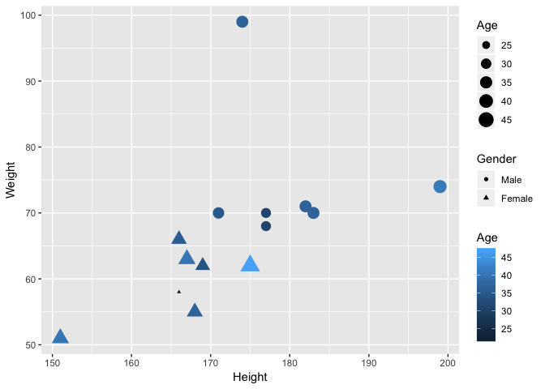
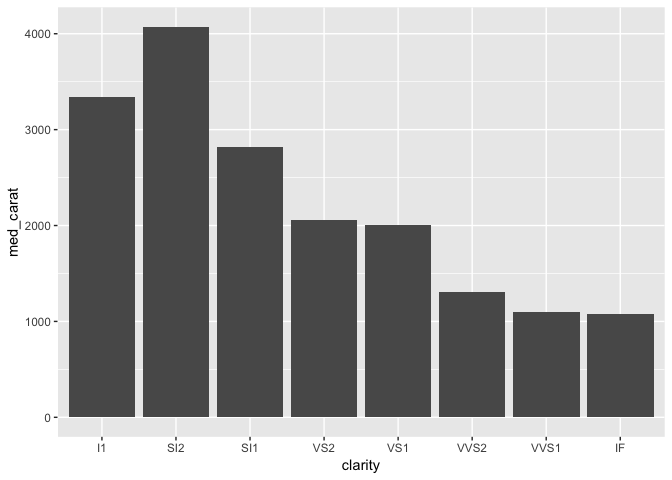

R Memo
================

Basic principle: STOP whenever you have an **error message**: it's useless to continue!
A large majority of commands use an arrow "&lt;-". The following line

a &lt;- b

means that the software will put value b inside variable a.

1 - BASICS
----------

### Packages

You need to install a package only once, but you need to activate it each time you start a new R session. The hashtag is use to append comments to the code.

``` r
if (!require("tidyverse")) install.packages('tidyverse') # This line to install, if it has not already been done.
```

    ## Loading required package: tidyverse

    ## ── Attaching packages ──────────────────────────────────────────────────────────────────────────────────────── tidyverse 1.2.1 ──

    ## ✔ ggplot2 3.0.0     ✔ purrr   0.2.5
    ## ✔ tibble  1.4.2     ✔ dplyr   0.7.6
    ## ✔ tidyr   0.8.1     ✔ stringr 1.3.1
    ## ✔ readr   1.1.1     ✔ forcats 0.3.0

    ## ── Conflicts ─────────────────────────────────────────────────────────────────────────────────────────── tidyverse_conflicts() ──
    ## ✖ dplyr::filter() masks stats::filter()
    ## ✖ dplyr::lag()    masks stats::lag()

``` r
library(tidyverse)                                       # This line to activate. Note: quotes are unnecessary here.
```

### Working directory

R works in one particular folder. You can fix it in the Files pane in RStudio. Or you can use the setwd() function. To see what is the current working directory, type getwd().

### Variables vs functions

Two major items in R: the functions that you are going to use (like in Excel: sum(), min(), etc.) and the variables that you will manipulate. There is a **MAJOR** difference between the two! In terms of code, there is only one small (but important!) difference: functions work with *round* brackets () and data variables work with *square* brackets \[\].
For a function, for instance the square root function sqrt(), there is always an argument inside the round brackets: it is the element on which the function will work. sqrt(5) will produce the square root of five. For a variable, the numbers inside the square brackets will relate to indexing (more on that below).

### Importing data

This is usually done directly in the user interface, or with packages like *openxlsx* or *readxl* (to import Excel files) with the function read.xlsx() or read\_excel(). The basic case:test\_data &lt;- read.xlsx("MyFile.xlsx") or test\_data &lt;- read\_excel("MyFile.xlsx").
This stores your data into the test\_data variable. This assumes that the Excel file "MyFile.xlsx" exists in your working directory.

2 - CREATING DATA
-----------------

### Simple sequences

You can create data from scratch, using the colon operator for instance.

``` r
1:10
```

    ##  [1]  1  2  3  4  5  6  7  8  9 10

``` r
3:17
```

    ##  [1]  3  4  5  6  7  8  9 10 11 12 13 14 15 16 17

More generally, the c() function concatenates and encapsulates numbers (or text):

``` r
c(2,5,7)
```

    ## [1] 2 5 7

``` r
c(1:6,12:20)
```

    ##  [1]  1  2  3  4  5  6 12 13 14 15 16 17 18 19 20

``` r
c("R", " is ", "awesome")
```

    ## [1] "R"       " is "    "awesome"

Another way to replicate data is to use row-bind and column-bind functions rbind() and cbind().

``` r
rbind(c(2,5,7),c(3,1,8)) 
```

    ##      [,1] [,2] [,3]
    ## [1,]    2    5    7
    ## [2,]    3    1    8

``` r
cbind(c(2,5,7),c(3,1,8)) 
```

    ##      [,1] [,2]
    ## [1,]    2    3
    ## [2,]    5    1
    ## [3,]    7    8

You can also fill in matrices:

``` r
m <- matrix(1:20, nrow = 4) 
m2 <- matrix(1:20, nrow = 4, byrow = T)
m
```

    ##      [,1] [,2] [,3] [,4] [,5]
    ## [1,]    1    5    9   13   17
    ## [2,]    2    6   10   14   18
    ## [3,]    3    7   11   15   19
    ## [4,]    4    8   12   16   20

``` r
m2
```

    ##      [,1] [,2] [,3] [,4] [,5]
    ## [1,]    1    2    3    4    5
    ## [2,]    6    7    8    9   10
    ## [3,]   11   12   13   14   15
    ## [4,]   16   17   18   19   20

R is great to generate random data.

``` r
runif(10) # uniform distribution
```

    ##  [1] 0.57166659 0.48775593 0.79482325 0.76337533 0.78035032 0.07132093
    ##  [7] 0.36915444 0.58100022 0.42408701 0.49200799

``` r
rnorm(10) # Gaussian distribution (parameters could be specified, see online manual) 
```

    ##  [1]  0.97872609  0.86679129 -0.17654969 -1.25140553 -0.34161518
    ##  [6] -0.51683276  0.06225576  0.28322748 -0.54144594  0.73427120

### Dataframes

Datasets often mix text and numbers. R can do that too, with data frames. Let's create one with the data.frame() function. We use the round() function which rounds up numbers.

``` r
nb_gender <- 7                                            # Number of people of each gender
Gender <- rep(c("Male"),nb_gender)                        # nb_gender men in total
Weight <-  round(70 + rnorm(nb_gender)*5)                 # in kilos
Height <-  round(176 + rnorm(nb_gender)*10)               # in cm
Age <- round(40 + rnorm(nb_gender)*6)  
data <- data.frame(Gender,Weight,Height,Age)              # data with only men
Gender <- rep(c("Female"),nb_gender)                      # nb_gender women in total
Weight <-  round(58 + rnorm(nb_gender)*5)                 # in kilos
Height <-  round(167 + rnorm(nb_gender)*10)               # in cm
Age <- round(40 + rnorm(nb_gender)*6)  
data <- rbind(data, data.frame(Gender,Weight,Height,Age)) # grouping women with men
data
```

    ##    Gender Weight Height Age
    ## 1    Male     70    171  35
    ## 2    Male     70    183  37
    ## 3    Male     70    174  37
    ## 4    Male     70    177  31
    ## 5    Male     68    177  31
    ## 6    Male     71    182  37
    ## 7    Male     74    174  41
    ## 8  Female     62    169  34
    ## 9  Female     58    187  22
    ## 10 Female     62    175  47
    ## 11 Female     55    168  37
    ## 12 Female     51    151  40
    ## 13 Female     63    167  40
    ## 14 Female     66    166  36

You can use rownames() or colnames() to get or set the names of rows or columns: colnames(data).

### Dimensions

You can obtain the dimension of a matrix or data frame with the dim() function: dim(data). (Nb rows and nb columns). Each dimension can be obtained separately with nrow() and ncol() For vectors, the number of elements can be found with the length() function.

``` r
dim(data)
```

    ## [1] 14  4

``` r
nrow(data)
```

    ## [1] 14

``` r
ncol(data)
```

    ## [1] 4

``` r
length(3:35)
```

    ## [1] 33

### Boolean (TRUE/FALSE) data

In R, it is usefulto perform tests. For instance, given the sequence 1:12, we want to know which values are strictly greater than 6. The simple command 1:12&gt;6 will provide the answer: the statement is false for the first six elements (1 to 6) and true for the last six (7 to 12).

``` r
1:12>6
```

    ##  [1] FALSE FALSE FALSE FALSE FALSE FALSE  TRUE  TRUE  TRUE  TRUE  TRUE
    ## [12]  TRUE

3 - HANDLING DATA IN PURE R
---------------------------

### Extracting data

Accessing the values of a variable can be done with the square brackets \[\] thanks to indexing. For instance, the value in the third row and second column of data is data\[3,2\].
When columns have names, it is possible to use it to isolate a particular column with the dollar $ operator:

``` r
data$Age
```

    ##  [1] 35 37 37 31 31 37 41 34 22 47 37 40 40 36

Another way to proceed is to omit to specify the row numbers: since Height is the third column of data, then the result is the same with data\[,3\]. This give you all of the third column. Likewise, data\[3,\] will return all of the third row.

``` r
data[,3]
```

    ##  [1] 171 183 174 177 177 182 174 169 187 175 168 151 167 166

``` r
data[3,]
```

    ##   Gender Weight Height Age
    ## 3   Male     70    174  37

You can extract data with boolean vectors! For instance, if we want to select the people who are older than 42 years old: simple!

``` r
data$Age>42
```

    ##  [1] FALSE FALSE FALSE FALSE FALSE FALSE FALSE FALSE FALSE  TRUE FALSE
    ## [12] FALSE FALSE FALSE

will provide the corresponding indices. To extract the data, you just need to select the right rows and all columns:

``` r
data[data$Age>42,]
```

    ##    Gender Weight Height Age
    ## 10 Female     62    175  47

Only the TRUE rows are kept. As we will see, the filter() function of the tidyverse does just that.

### Writing / Replacing values

Writing on data frames, vectors, or matrices can be done with the arrow operator:

``` r
data[3,2] <- 99
data[c(7,9),3] <- 166 # Replace 2 cells at a time! Seventh and ninth row on the third column.
data[c(7,9),3] <- c(199,166) # Same, but with 2 different values.
data # CHECK where the new values are!
```

    ##    Gender Weight Height Age
    ## 1    Male     70    171  35
    ## 2    Male     70    183  37
    ## 3    Male     99    174  37
    ## 4    Male     70    177  31
    ## 5    Male     68    177  31
    ## 6    Male     71    182  37
    ## 7    Male     74    199  41
    ## 8  Female     62    169  34
    ## 9  Female     58    166  22
    ## 10 Female     62    175  47
    ## 11 Female     55    168  37
    ## 12 Female     51    151  40
    ## 13 Female     63    167  40
    ## 14 Female     66    166  36

### Seeing data

Unlike in Excel, the data is not directly shown in R. You have to ask for it! To see the content of a variable, you have to type its name and press ENTER.
The head() function shows the first 6 lines and the tail() function shows the last 6 lines.

``` r
head(data)
```

    ##   Gender Weight Height Age
    ## 1   Male     70    171  35
    ## 2   Male     70    183  37
    ## 3   Male     99    174  37
    ## 4   Male     70    177  31
    ## 5   Male     68    177  31
    ## 6   Male     71    182  37

The summary() function very often gives useful (statistical) information

``` r
summary(data)
```

    ##     Gender      Weight          Height           Age       
    ##  Male  :7   Min.   :51.00   Min.   :151.0   Min.   :22.00  
    ##  Female:7   1st Qu.:62.00   1st Qu.:167.2   1st Qu.:34.25  
    ##             Median :67.00   Median :172.5   Median :37.00  
    ##             Mean   :67.07   Mean   :173.2   Mean   :36.07  
    ##             3rd Qu.:70.00   3rd Qu.:177.0   3rd Qu.:39.25  
    ##             Max.   :99.00   Max.   :199.0   Max.   :47.00

### Date management

The best package for date management is lubridate. Dates can be converted using the as.Date(), and years, months and days can be retrieved using the year(), month() and day() functions.

``` r
if(!require(lubridate)){install.packages("lubridate")}
```

    ## Loading required package: lubridate

    ## 
    ## Attaching package: 'lubridate'

    ## The following object is masked from 'package:base':
    ## 
    ##     date

``` r
library(lubridate)
d <- as.Date("2000-02-02")
year(d)
```

    ## [1] 2000

``` r
month(d)
```

    ## [1] 2

``` r
day(d)
```

    ## [1] 2

4 - HANDLING DATA WITH THE TIDYVERSE
------------------------------------

### Manipulation

Filtering items is incredibly easy via filter(). The %in% operator can be useful when testing for several values.

``` r
filter(data, Age > 42)
```

    ##   Gender Weight Height Age
    ## 1 Female     62    175  47

``` r
filter(data, Gender == "Male", Weight > 70)
```

    ##   Gender Weight Height Age
    ## 1   Male     99    174  37
    ## 2   Male     71    182  37
    ## 3   Male     74    199  41

``` r
filter(diamonds, cut %in% c("Fair", "Good"))
```

    ## # A tibble: 6,516 x 10
    ##    carat cut   color clarity depth table price     x     y     z
    ##    <dbl> <ord> <ord> <ord>   <dbl> <dbl> <int> <dbl> <dbl> <dbl>
    ##  1  0.23 Good  E     VS1      56.9    65   327  4.05  4.07  2.31
    ##  2  0.31 Good  J     SI2      63.3    58   335  4.34  4.35  2.75
    ##  3  0.22 Fair  E     VS2      65.1    61   337  3.87  3.78  2.49
    ##  4  0.3  Good  J     SI1      64      55   339  4.25  4.28  2.73
    ##  5  0.3  Good  J     SI1      63.4    54   351  4.23  4.29  2.7 
    ##  6  0.3  Good  J     SI1      63.8    56   351  4.23  4.26  2.71
    ##  7  0.3  Good  I     SI2      63.3    56   351  4.26  4.3   2.71
    ##  8  0.23 Good  F     VS1      58.2    59   402  4.06  4.08  2.37
    ##  9  0.23 Good  E     VS1      64.1    59   402  3.83  3.85  2.46
    ## 10  0.31 Good  H     SI1      64      54   402  4.29  4.31  2.75
    ## # ... with 6,506 more rows

``` r
filter(diamonds, color %in% c("E", "F"))
```

    ## # A tibble: 19,339 x 10
    ##    carat cut       color clarity depth table price     x     y     z
    ##    <dbl> <ord>     <ord> <ord>   <dbl> <dbl> <int> <dbl> <dbl> <dbl>
    ##  1  0.23 Ideal     E     SI2      61.5    55   326  3.95  3.98  2.43
    ##  2  0.21 Premium   E     SI1      59.8    61   326  3.89  3.84  2.31
    ##  3  0.23 Good      E     VS1      56.9    65   327  4.05  4.07  2.31
    ##  4  0.22 Fair      E     VS2      65.1    61   337  3.87  3.78  2.49
    ##  5  0.22 Premium   F     SI1      60.4    61   342  3.88  3.84  2.33
    ##  6  0.2  Premium   E     SI2      60.2    62   345  3.79  3.75  2.27
    ##  7  0.32 Premium   E     I1       60.9    58   345  4.38  4.42  2.68
    ##  8  0.23 Very Good E     VS2      63.8    55   352  3.85  3.92  2.48
    ##  9  0.23 Very Good F     VS1      60.9    57   357  3.96  3.99  2.42
    ## 10  0.23 Very Good F     VS1      60      57   402  4     4.03  2.41
    ## # ... with 19,329 more rows

Ordering according to a particular variable is performed with top\_n().

``` r
top_n(data, 3, Height)   # Tallest 3 individuals
```

    ##   Gender Weight Height Age
    ## 1   Male     70    183  37
    ## 2   Male     71    182  37
    ## 3   Male     74    199  41

``` r
top_n(data, -4, Weight)  # Lightest 4 individuals
```

    ##   Gender Weight Height Age
    ## 1 Female     62    169  34
    ## 2 Female     58    166  22
    ## 3 Female     62    175  47
    ## 4 Female     55    168  37
    ## 5 Female     51    151  40

Selecting a few columns with select().

``` r
select(data, Gender, Age)
```

    ##    Gender Age
    ## 1    Male  35
    ## 2    Male  37
    ## 3    Male  37
    ## 4    Male  31
    ## 5    Male  31
    ## 6    Male  37
    ## 7    Male  41
    ## 8  Female  34
    ## 9  Female  22
    ## 10 Female  47
    ## 11 Female  37
    ## 12 Female  40
    ## 13 Female  40
    ## 14 Female  36

Adding new columns can be performed with the mutate() function. Below, we compute the price/carat ratio of diamonds. The mutate function() is THE best choice to add columns that are easily calculated.

``` r
diamonds %>% 
    select(-x, -y, -z, - depth, -table) %>% # Getting rid of less useful variables
    mutate(P_C_ratio = price/carat)
```

    ## # A tibble: 53,940 x 6
    ##    carat cut       color clarity price P_C_ratio
    ##    <dbl> <ord>     <ord> <ord>   <int>     <dbl>
    ##  1 0.23  Ideal     E     SI2       326     1417.
    ##  2 0.21  Premium   E     SI1       326     1552.
    ##  3 0.23  Good      E     VS1       327     1422.
    ##  4 0.290 Premium   I     VS2       334     1152.
    ##  5 0.31  Good      J     SI2       335     1081.
    ##  6 0.24  Very Good J     VVS2      336     1400 
    ##  7 0.24  Very Good I     VVS1      336     1400 
    ##  8 0.26  Very Good H     SI1       337     1296.
    ##  9 0.22  Fair      E     VS2       337     1532.
    ## 10 0.23  Very Good H     VS1       338     1470.
    ## # ... with 53,930 more rows

### Piping

Very often, several operations are required before the desired output is obtained. There is an elegant way to successively combine functions. It is called piping and works with the operator %&gt;%.

``` r
data %>% select(Gender, Height, Age) %>% filter(Age > 40) # The two functions select() and filter() are applied 
```

    ##   Gender Height Age
    ## 1   Male    199  41
    ## 2 Female    175  47

### Pivot tables

Pivot tables (PT) are very simply obtained via the combination of group\_by() summarise(). group\_by() determines along which variables the PT will be computed and summarise() specifies the metric/indicator of interest.

``` r
diamonds %>% 
    group_by(cut, color, clarity) %>% 
    summarise(med_price = median(price), med_carat = median(price))
```

    ## # A tibble: 276 x 5
    ## # Groups:   cut, color [?]
    ##    cut   color clarity med_price med_carat
    ##    <ord> <ord> <ord>       <dbl>     <dbl>
    ##  1 Fair  D     I1          5538.     5538.
    ##  2 Fair  D     SI2         3473      3473 
    ##  3 Fair  D     SI1         3900      3900 
    ##  4 Fair  D     VS2         4107      4107 
    ##  5 Fair  D     VS1         2747      2747 
    ##  6 Fair  D     VVS2        1980      1980 
    ##  7 Fair  D     VVS1        1792      1792 
    ##  8 Fair  D     IF          1440      1440 
    ##  9 Fair  E     I1          2036      2036 
    ## 10 Fair  E     SI2         3438.     3438.
    ## # ... with 266 more rows

### Graphs

In R, there is one major function for graphical representation: ggplot().

``` r
ggplot(data) + geom_point(aes(x = Height, y = Weight, color = Age, shape = Gender, size = Age))
```



``` r
ggplot(diamonds) + geom_bar(aes(x = clarity, fill = cut))
```


``` r
diamonds %>% 
    group_by(clarity) %>% 
    summarise(med_carat = median(price)) %>%
    ggplot(aes(x = clarity, y = med_carat)) + geom_bar(stat = "identity")
```



``` r
 # When providing a "y" for a barplot, you must specify the stat="identity". This graph shows that large diamonds are much less "pure" than smaller ones. Which makes sense.
```

5 - LOOPS
---------

There are usually several types of loops, but we will focus on the *for* loop. Its structure is simple: the idea is to repeat a task a finite number of times. This allows to automate the changes in a variable. For instance, the Fibonacci sequence:

``` r
nb <- 20  # Number of desired numbers
Fib <- 1  # Initiate the output (it will be incrementally augmented)
Fib[2] <- 1
for(k in 3:nb){
   Fib[k] <- Fib[k-1] + Fib[k-2]
}
Fib # Show the sequence
```

    ##  [1]    1    1    2    3    5    8   13   21   34   55   89  144  233  377
    ## [15]  610  987 1597 2584 4181 6765

6 - MISC. FUNCTIONS
-------------------

### Statistics

Below, we present a few useful functions.

``` r
rbind(c(2,5,7),c(3,1,8)) 
```

    ##      [,1] [,2] [,3]
    ## [1,]    2    5    7
    ## [2,]    3    1    8

``` r
rbind(c(2,5,7),c(3,1,8)) %>% t()    # Transpose (a vector, a matrix, a dataframe)
```

    ##      [,1] [,2]
    ## [1,]    2    3
    ## [2,]    5    1
    ## [3,]    7    8

``` r
sqrt(5)                             # Square root
```

    ## [1] 2.236068

``` r
mean(c(2:6, 8:43))                  # Average value
```

    ## [1] 22.87805

``` r
sd(c(2:6, 8:43))                    # Standard deviation, use var() for the variance
```

    ## [1] 12.17004

``` r
v <- rnorm(18)                      # We generate a random vector
min(v)                              # Minimum
```

    ## [1] -1.569594

``` r
max(v)                              # Maximum
```

    ## [1] 0.8473214

``` r
v                                   # A look at the whole vector
```

    ##  [1]  0.782094350 -0.987155214 -0.560735485 -1.105928003  0.007747949
    ##  [6] -0.241435367 -0.549345336 -1.303078707  0.214465976  0.032605234
    ## [11] -1.569593774 -1.131743863  0.285518678  0.847321418 -0.704746948
    ## [16]  0.652243553  0.293385900  0.422454874

``` r
lag(1:10)                           # The lag() function: shifts data to the right
```

    ##  [1] NA  1  2  3  4  5  6  7  8  9

``` r
mean(c(NA,1:10), na.rm = T)         # When computing means, if values are missing, NA will be returned. na.rm = T solves this.
```

    ## [1] 5.5

### Changing modes

Usual modes for variables are:
- logical (Boolean, TRUE or FALE),
- numeric (numbers),
- character (text),
- factor (unordered category) and
- ordered factor (ordered category)
It is sometimes possible to switch from one to another. One counter-example is: translating a charater into a number.
Some examples below.

``` r
c("3", "8", "7")                    # Numbers viewed as text 
```

    ## [1] "3" "8" "7"

``` r
c("3", "8", "7") %>% as.numeric()   # Change the above into *true* numbers
```

    ## [1] 3 8 7

``` r
c(3,4,6) %>% as.character()         # The opposite: change fields into characters
```

    ## [1] "3" "4" "6"

``` r
data$Age %>% as.factor() %>% summary() # as.factor() transforms the fields into catagories, the final step computes the number of elements in each catergory
```

    ## 22 31 34 35 36 37 40 41 47 
    ##  1  2  1  1  1  4  2  1  1
