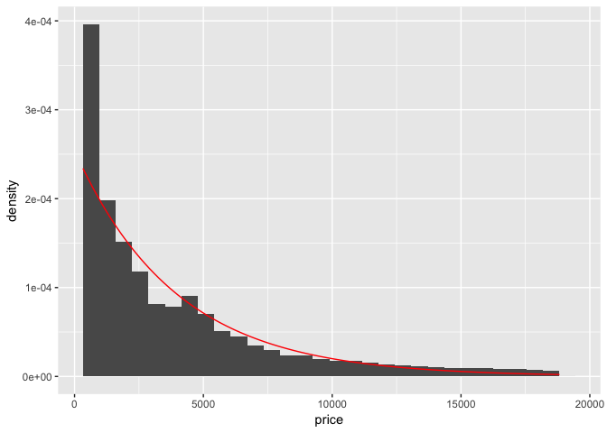
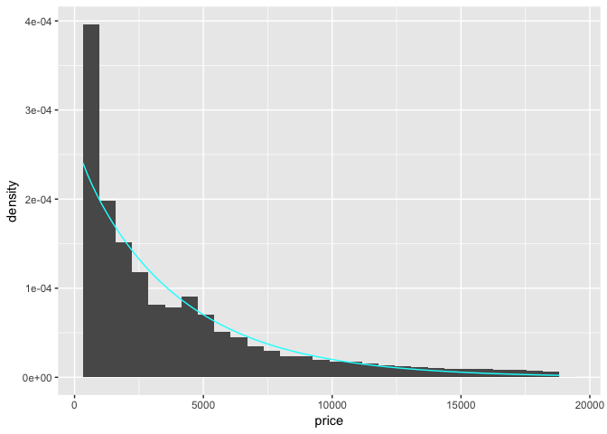

Maximum Likelihood Estimation
================

This is the companion notebook to the course on Maximum Likelihood.

``` r
if (!require("bbmle")) install.packages("bbmle") # Only installs if missing
library(bbmle)
library(tidyverse)
```

Moment Matching
---------------

Let's try to fit an exponential distribution to the prices of diamonds.

``` r
m <- mean(diamonds$price)
ggplot(diamonds, aes(x = price)) + geom_histogram(aes(y = ..density..)) + stat_function(fun = dexp, args = list(1/m), color = "red")
```



A better fit could be obtained by a family with 2 parameters: let's try the gamma distribution.

``` r
m <- mean(diamonds$price)
v <- var(diamonds$price)
ggplot(diamonds, aes(x = price)) + geom_histogram(aes(y = ..density..)) + stat_function(fun = dgamma, args = list(shape = m^2/v, rate = m/v), color = "cyan")
```



Maximum Likelihood Estimation
-----------------------------

Below, we perform the MLE of the price distribution. We scale the prices by a kilo factor and use a target gamma distribution.

``` r
par <- mle2(price / 1000 ~ dgamma(shape, rate), start = list(shape = 2, rate = 2), data = diamonds) # Using the new package; WARINING: prices were scaled.
par@coef # Just to see the values of the parameters 
```

    ##     shape      rate 
    ## 1.1580360 0.2944673

``` r
nLL <- function(s, r) -sum(stats::dgamma(diamonds$price / 1000, s, r, log = TRUE)) # Using the old package
fit <- mle(nLL, start = list(s = 2, r = 2))
fit@coef # Again, just having a look: they match!
```

    ##         s         r 
    ## 1.1580360 0.2944673

``` r
diamonds %>% ggplot() + geom_histogram(aes(x = price / 1000, y = ..density..)) + stat_function(fun = dgamma, args = list(shape = fit@coef[1], rate = fit@coef[2]), color = "red")
```

    ## `stat_bin()` using `bins = 30`. Pick better value with `binwidth`.


Finally, we take a look at the distribution of carats inside the dataset.

``` r
par <- mle2(carat ~ dgamma(shape, rate), start = list(shape = 1, rate = 2), data = diamonds) # Using the new package
par@coef
```

    ##    shape     rate 
    ## 3.111010 3.898804

``` r
nLL <- function(s, r) -sum(stats::dgamma(diamonds$carat, shape = s, rate = r, log = TRUE)) # Using the old package
fit <- mle(nLL, start = list(s = 2, r = 2))
fit@coef
```

    ##        s        r 
    ## 3.111011 3.898804

``` r
diamonds %>% ggplot() + geom_histogram(aes(x = carat, y = ..density..)) + stat_function(fun = dgamma, args = list(shape = fit@coef[1], rate = fit@coef[2]), color = "red")
```

    ## `stat_bin()` using `bins = 30`. Pick better value with `binwidth`.


