Distributions
================

-   [Early illustrations](#early-illustrations)
    -   [Convergence from histogram (discrete) to density (continuous)](#convergence-from-histogram-discrete-to-density-continuous)
-   [Parametric families](#parametric-families)
    -   [Continuous distributions over the real line](#continuous-distributions-over-the-real-line)
    -   [Positive continuous distributions](#positive-continuous-distributions)
    -   [Discrete distributions](#discrete-distributions)
    -   [Strange mixes](#strange-mixes)
-   [Correlations](#correlations)
-   [Exercises](#exercises)
    -   [Plotting](#plotting)
    -   [Descriptive statistics for the Cauchy distribution](#descriptive-statistics-for-the-cauchy-distribution)
    -   [Significance levels for the Gaussian distribution](#significance-levels-for-the-gaussian-distribution)
    -   [HARDER: function creation](#harder-function-creation)

Early illustrations
-------------------

We are interested in prices and carats of diamonds. To get a glimpse of their distribution, it is customary to plot histograms. The bins parameter corresponds to the number of small rectangles on the x-axis.

``` r
library(tidyverse)
diamonds %>% filter(carat < 2.55) %>% ggplot() + geom_histogram(aes(x = carat), bins = 100)
```

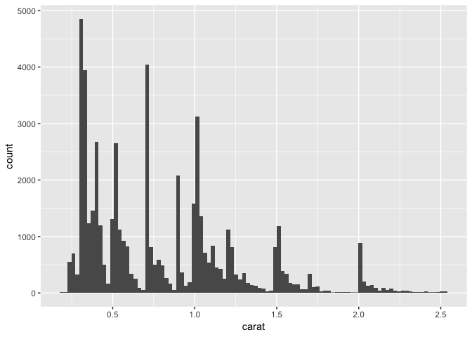

``` r
diamonds %>% filter(carat < 1.1) %>% ggplot() + geom_histogram(aes(x = carat), bins = 200) # Higher precision for small diamonds
```


``` r
diamonds %>% filter(carat < 2.55) %>% ggplot() + geom_histogram(aes(x = price), bins = 30)
```


``` r
diamonds %>% ggplot(aes(x = cut)) + geom_bar(aes(y = (..count..)/sum(..count..))) + ylab("Proportion")
```

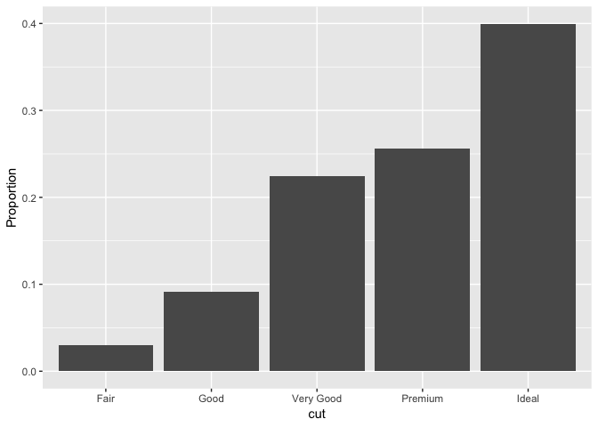

Sometimes, it is easier to quantify the distribution of a variable with a few numbers: the mean, the standard deviation, etc. They are usually called the 'descriptive statistics'.

``` r
diamonds %>% summary()                            # Canonical R function for descriptive statistics
```

    ##      carat               cut        color        clarity     
    ##  Min.   :0.2000   Fair     : 1610   D: 6775   SI1    :13065  
    ##  1st Qu.:0.4000   Good     : 4906   E: 9797   VS2    :12258  
    ##  Median :0.7000   Very Good:12082   F: 9542   SI2    : 9194  
    ##  Mean   :0.7979   Premium  :13791   G:11292   VS1    : 8171  
    ##  3rd Qu.:1.0400   Ideal    :21551   H: 8304   VVS2   : 5066  
    ##  Max.   :5.0100                     I: 5422   VVS1   : 3655  
    ##                                     J: 2808   (Other): 2531  
    ##      depth           table           price             x         
    ##  Min.   :43.00   Min.   :43.00   Min.   :  326   Min.   : 0.000  
    ##  1st Qu.:61.00   1st Qu.:56.00   1st Qu.:  950   1st Qu.: 4.710  
    ##  Median :61.80   Median :57.00   Median : 2401   Median : 5.700  
    ##  Mean   :61.75   Mean   :57.46   Mean   : 3933   Mean   : 5.731  
    ##  3rd Qu.:62.50   3rd Qu.:59.00   3rd Qu.: 5324   3rd Qu.: 6.540  
    ##  Max.   :79.00   Max.   :95.00   Max.   :18823   Max.   :10.740  
    ##                                                                  
    ##        y                z         
    ##  Min.   : 0.000   Min.   : 0.000  
    ##  1st Qu.: 4.720   1st Qu.: 2.910  
    ##  Median : 5.710   Median : 3.530  
    ##  Mean   : 5.735   Mean   : 3.539  
    ##  3rd Qu.: 6.540   3rd Qu.: 4.040  
    ##  Max.   :58.900   Max.   :31.800  
    ## 

``` r
diamonds %>% select(carat, price) %>% apply(2,sd) # Computing the standard deviation over carats & prices
```

    ##        carat        price 
    ##    0.4740112 3989.4397381

``` r
diamonds %>% select(carat, price) %>% filter(carat < 2.1) %>% summary() 
```

    ##      carat           price      
    ##  Min.   :0.200   Min.   :  326  
    ##  1st Qu.:0.400   1st Qu.:  942  
    ##  Median :0.700   Median : 2357  
    ##  Mean   :0.775   Mean   : 3765  
    ##  3rd Qu.:1.030   3rd Qu.: 5166  
    ##  Max.   :2.090   Max.   :18818

The last computation illustrates the sensitivity of the mean. In the first batch of stats, the average price was 3933 and it is 3765 over the filtered data (omitting large diamonds makes the average price go down). The mean is sensitive to extreme points. It's not the case for the median (2401 =&gt; 2357). The median is much more stable and less sensitive to outliers.

The reason why it is convenient to work with a single figure is that it can easily be computed on many subsamples. It is harder to visually analyse many distributions. Below, we analyse many subcases, i.e., when working with subgroups pertaining to each combination of cut, clarity and color.

``` r
means <- diamonds %>% group_by(cut, clarity, color) %>%  # We build a pivot table over cut, clarity and color
  summarize(avg_carat = mean(carat), avg_price = mean(price))
means %>% ggplot(aes(x = avg_carat, y = avg_price)) + geom_point(aes(color = clarity, size = cut))
```


``` r
means %>% ggplot(aes(x = avg_carat, y = avg_price)) + geom_point(aes(color = cut, size = clarity))
```


The above plots reveal different clusters! Typically, they show the impact of the clarity on the size of the diamonds (and hence on their price). Or is it the other way around? Heuristically, it is almost impossible to reach flawlessness on a large diamond.

For the sake of illustration, we plot a series of histograms that characterize the price distribution over various subsets of diamonds. The x-axis and y-axis are common across all histograms to ease comparison.

``` r
diamonds %>% ggplot(aes(x = price)) + 
    geom_histogram(bins = 10) + 
    facet_grid(cut ~ color) +
    theme(text = element_text(size=12))
```

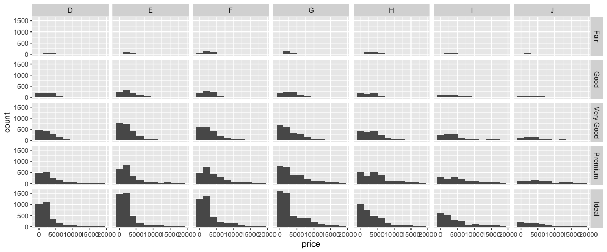

While the view is much more complete, the analysis takes longer.

### Convergence from histogram (discrete) to density (continuous)

Below, we illustrate the convergence of a histogram to the density of a continuous distribution. We use the canonical Gaussian law as example. If we want to switch from counts to density values, we must specify 'y = ..density..' inside the aes() of ggplot.

``` r
x <- rnorm(10^6) %>% data.frame()
colnames(x) <- "simulation"
x %>% ggplot(aes(x = simulation)) + geom_histogram(bins = 20)
```

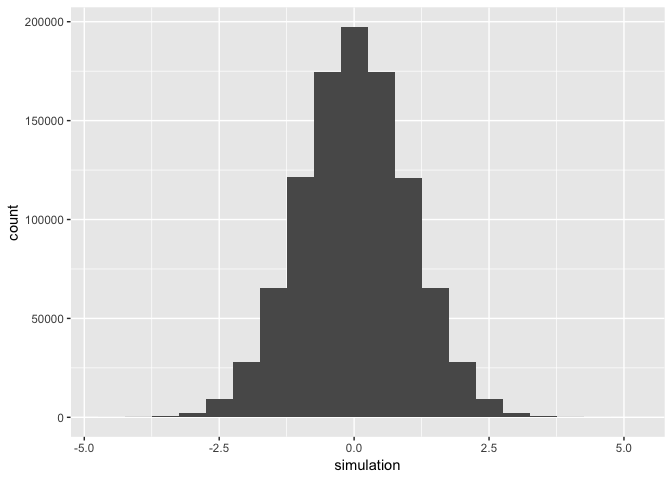

``` r
x %>% ggplot(aes(x = simulation)) + geom_histogram(bins = 100)
```

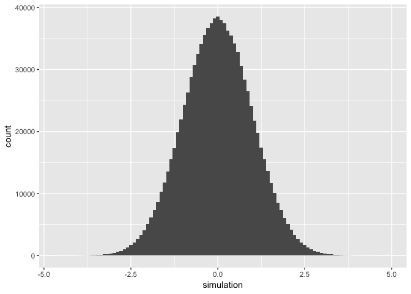

``` r
x %>% ggplot(aes(x = simulation, y = ..density..)) + geom_histogram(bins = 1000)
```

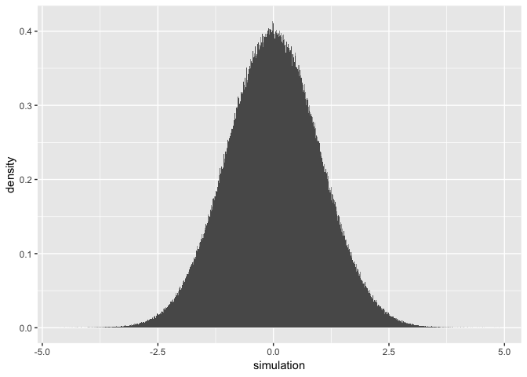

Parametric families
-------------------

For modelling purposes, it is convenient to specify simple functions that characterize distributions. An exhaustive list of probability distributions is provided here: <https://en.wikipedia.org/wiki/List_of_probability_distributions>

### Continuous distributions over the real line

The most famous of them is the Gaussian (normal) distribution, which was just used above. We show the impact of its parameters on its density.

``` r
ggplot(data.frame(x = c(-6, 9)), aes(x)) + 
  stat_function(fun = dnorm, args = list(mean = 0, sd = 1), aes(color = "m = 0.0, s = 1.0")) +
  stat_function(fun = dnorm, args = list(mean = 0.5, sd = 1.5), aes(color = "m = 0.5, s = 1.5")) +
  stat_function(fun = dnorm, args = list(mean = 1, sd = 2), aes(color = "m = 1.0, s = 2.0")) +
  stat_function(fun = dnorm, args = list(mean = 1.5, sd = 2.5), aes(color = "m = 1.5, s = 2.5")) +
  scale_colour_manual("Legend", values = c("#B266FF", "#6666FF", "#66B2FF", "#00FF80"))
```

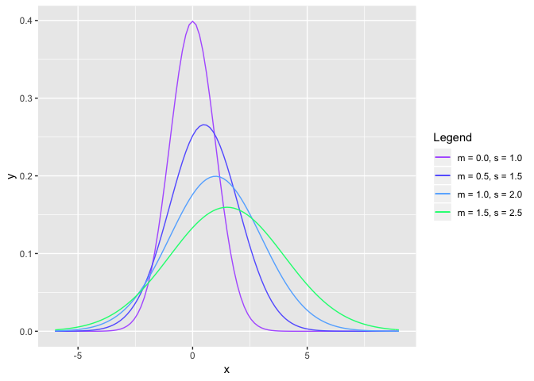

The coding of many RGB colors can be found here: <https://www.rapidtables.com/web/color/RGB_Color.html>
The Gaussian distribution has very light tails: extreme points are very rare. Its heavy-tailed *cousin* is the Student distribution. Below, we show the difference between the two: it is salient for extreme values (to the left or to the right).

``` r
ggplot(data.frame(x = c(-7, 7)), aes(x)) + 
  stat_function(fun = dt, args = list(df = 0.5), aes(color = "df = 0.5 (Student)")) +
  stat_function(fun = dt, args = list(df = 1.0), aes(color = "df = 1.0 (Student)")) + 
  stat_function(fun = dt, args = list(df = 2.0), aes(color = "df = 2.0 (Student)")) + 
  stat_function(fun = dnorm, args = list(mean = 0, sd = 2), aes(color = "m = 0, s = 2.0 (Gaussian)")) 
```


``` r
ggplot(data.frame(x = c(-9, -3)), aes(x)) + 
  stat_function(fun = dt, args = list(df = 0.5), aes(color = "df = 0.5 (Student)")) +
  stat_function(fun = dt, args = list(df = 1.0), aes(color = "df = 1.0 (Student)")) + 
  stat_function(fun = dt, args = list(df = 2.0), aes(color = "df = 2.0 (Student)")) + 
  stat_function(fun = dnorm, args = list(mean = 0, sd = 2), aes(color = "m = 0, s = 2.0 (Gaussian)")) 
```


On the second graph, we have zoomed on the left tail to see the difference.

### Positive continuous distributions

The gamma distribution is one archetypal such distribution. It nests the exponential family as a special case. Below, the cases a = 1 correspond to exponential distributions.

``` r
ggplot(data.frame(x = c(0, 6)), aes(x)) + 
  stat_function(fun = dgamma, args = list(rate = 1, shape = 1), aes(color = "a = 1, b = 1")) +
  stat_function(fun = dgamma, args = list(rate = 1, shape = 2), aes(color = "a = 2, b = 1")) +
  stat_function(fun = dgamma, args = list(rate = 2, shape = 1), aes(color = "a = 1, b = 2")) +
  stat_function(fun = dgamma, args = list(rate = 2, shape = 2), aes(color = "a = 2, b = 2")) +
  scale_colour_manual("Legend", values = c("#FF3333", "#FF9933", "#66B2FF", "#00FF80"))
```


The beta distribution is a convenient choice when working with continuous data over a finite interval. Its density is very flexible with only two parameters. The diversity in shapes is very useful.

``` r
ggplot(data.frame(x = c(0, 1)), aes(x)) + 
  stat_function(fun = dbeta, args = list(shape1 = 0.4, shape2 = 0.6), aes(color = "a = 0.4, b = 0.6")) +
  stat_function(fun = dbeta, args = list(shape1 = 1, shape2 = 3), aes(color = "a = 1, b = 3")) +
  stat_function(fun = dbeta, args = list(shape1 = 1, shape2 = 5), aes(color = "a = 1, b = 5")) +
  stat_function(fun = dbeta, args = list(shape1 = 2, shape2 = 2), aes(color = "a = 2, b = 2")) +
  stat_function(fun = dbeta, args = list(shape1 = 2, shape2 = 6), aes(color = "a = 2, b = 6")) +
  scale_colour_manual("Legend", values = c("#9933FF","#FF3333", "#FF9933", "#66B2FF", "#00FF80"))
```

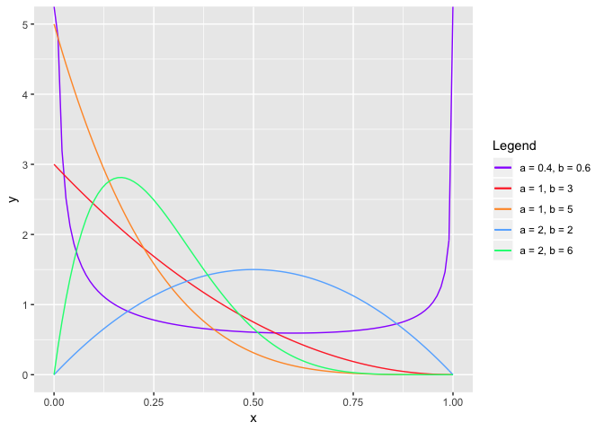

Other examples include the Pareto and the lognormal distributions.
Another class of continuous distributions is that of laws with bounded support. The uniform and the beta laws belong to this class.

### Discrete distributions

The most classical ones are the Poisson (infinite support) and binomial distributions (finite support).

``` r
ggplot(data.frame(x = c(0,8)), aes(x)) + 
  stat_function(aes(color = "lambda = 1"), geom = "point", n = 9, fun = dpois, args = list(lambda = 1)) +
  stat_function(aes(color = "lambda = 2"), geom = "point", n = 9, fun = dpois, args = list(lambda = 2)) +
  stat_function(aes(color = "lambda = 3"), geom = "point", n = 9, fun = dpois, args = list(lambda = 3))
```

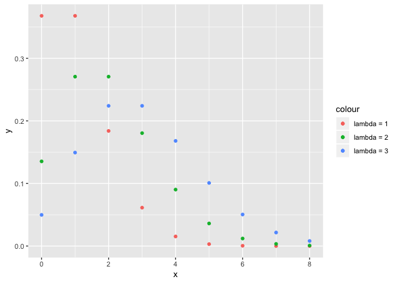

Other usual families: hypergeometric, beta-binomial (finite support), negative binomial (infinite support).

One last graph to show the shape of cumulative distribution functions.

``` r
ggplot(data.frame(x = c(-3,5)), aes(x)) + 
  stat_function(fun = pnorm, args = list(mean = 0, sd = 1), aes(color = "GAUSSIAN, m = 0.0, s = 1.0")) +
  stat_function(aes(color = "POISSON, lambda = 2"), geom = "point", n = 9, fun = ppois, args = list(lambda = 2)) 
```

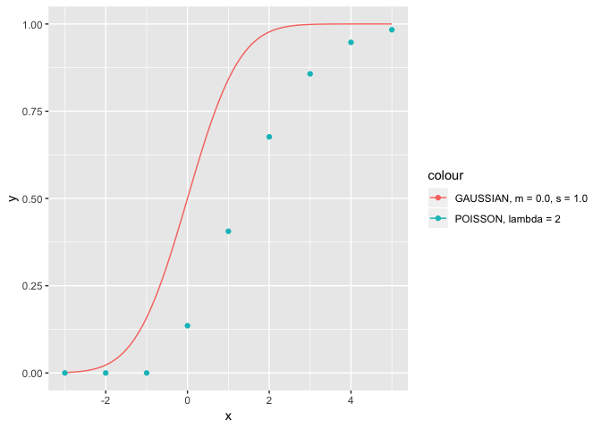

### Strange mixes

Densities can have strange shapes.

``` r
dens = function(x){(dnorm(x,2,3) + dt(x,2))/2 } # DENSITY NOT EQUAL TO THAT OF THE SUM OF THE TWO CORRESPONDING RVs!!!
dens_2 = function(x){(dnorm(x,-2,0.8) + dnorm(x,1,1.2))/2 }
ggplot(data.frame(x = c(-6, 9)), aes(x)) + stat_function(fun = dens, aes(color = "mix_1")) +
  stat_function(fun = dens_2, aes(color = "mix_2"))
```

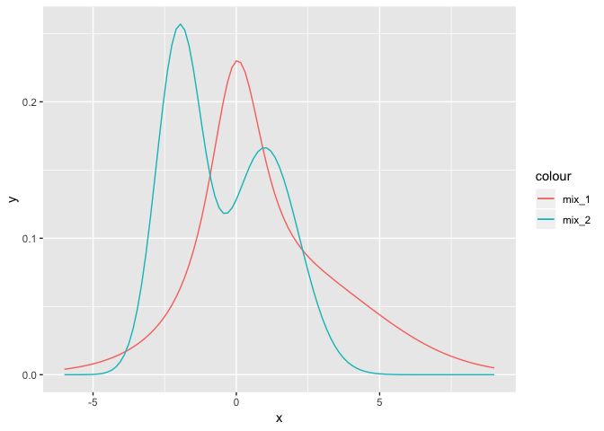

Correlations
------------

Very often, variables come in groups. Studying their univariate properties is of course useful, but understanding how they interact is sometimes even more insightful. Because we expect the size of a diamond to have a predominant impact on its price, the variables price and carat should be strongly positively correlated. In R, we simply use the cor() function.

``` r
cor(diamonds$carat, diamonds$price) # Correlation
```

    ## [1] 0.9215913

And it is indeed the case. Correlations above 0.9 indicate a strong link between the two variables.

A stylized sample is visually clear.

``` r
library(MASS)
```

    ## 
    ## Attaching package: 'MASS'

    ## The following object is masked from 'package:dplyr':
    ## 
    ##     select

``` r
m <- c(0,0) # Means
rho <- 0.9  # Correlation
sig <- rbind(c(1,rho), c(rho,1)) # Covariance matrix
z <- mvrnorm(1000, mu = m, Sigma = sig) %>% data.frame() # Data generation
ggplot(z, aes(x = X1, y = X2)) + geom_point()
```

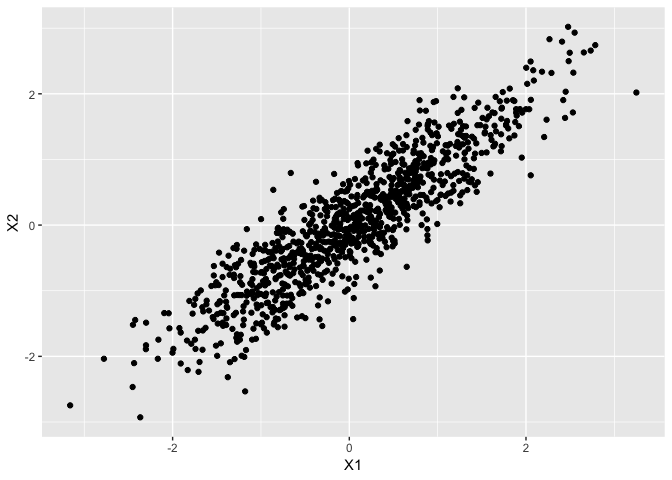

Let's see what happens with diamonds! Below, we use a great feature of R and ggplot that allows to show a multitude of subplots at the same time: facets!

``` r
diamonds %>% 
    ggplot(aes(x = carat, y = price, color = clarity)) + 
    geom_point() +                       # Scatter plots
    facet_grid(color ~ cut) +            # The faceting
    theme(text = element_text(size=12))  # Font size
```

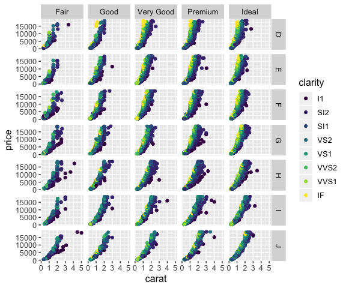

Obviously, the correlation is positive. The slopes are probably non-linear and depend both on clarity and color. Note that there are almost no pure diamonds with Fair cuts. Pure diamonds are those associated to the strongest slopes: their prices increase steadily with their weights.

Exercises
---------

### Plotting

1.  Plot the density of a Cauchy distribution with parameters: location = 1, scale = 2.
2.  Plot the following density: f(x) = 0.25*(1+abs(x))^(-1.5).

### Descriptive statistics for the Cauchy distribution

1.  The standard Cauchy distribution has a density f(x) = 1 / (pi\*(1+x^2)). What are its mean and variance?
2.  Using the rcauchy(n,0,1) function to simulate samples, create a dataframe that stores the mean and variance for n = 10^k samples with k = 1,...,7.
3.  Comment the results and plot the variance using a logarithmic scale for the y-axis: + scale\_y\_log10(). Is the theoretical result from 1) verified?

### Significance levels for the Gaussian distribution

Using the rnorm(n,0,1) function, approximate via a large number of samples the probability that a standard Normal variable be greater than 1.96 in absolute value.

### HARDER: function creation

Create a function which computes, from a given series its sample skewness. Same for kurtosis.
