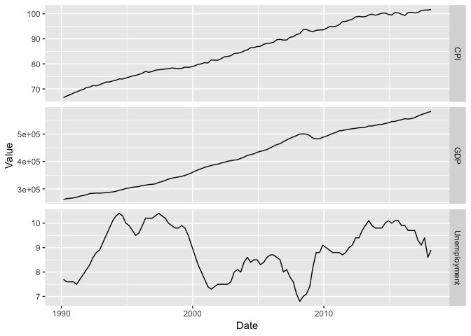
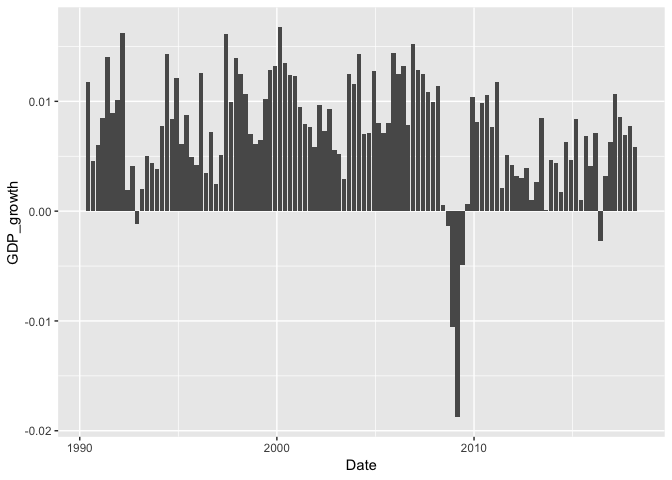
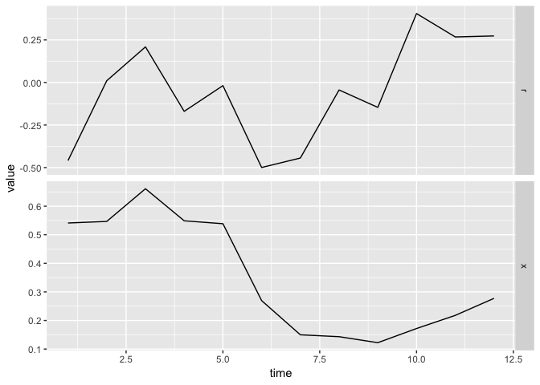
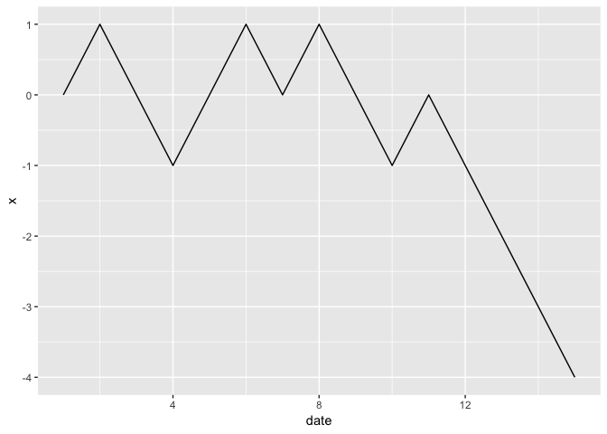
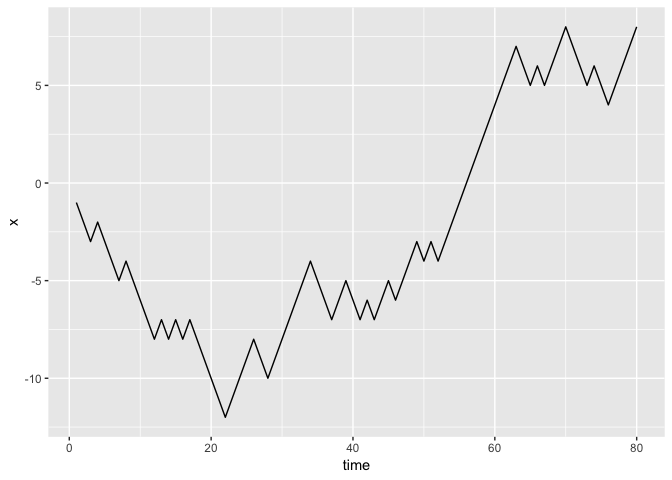
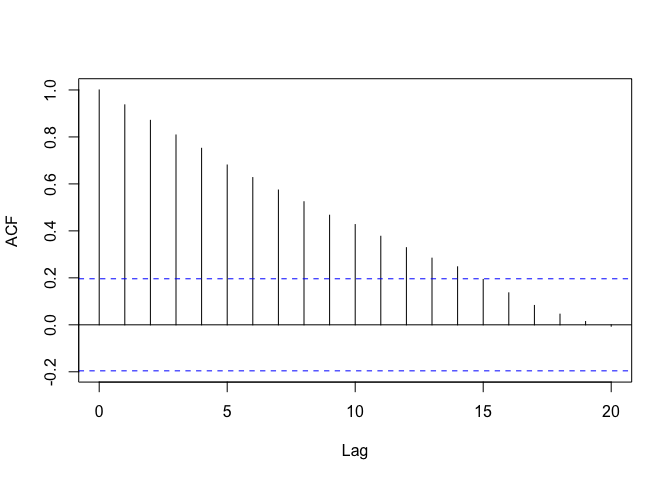
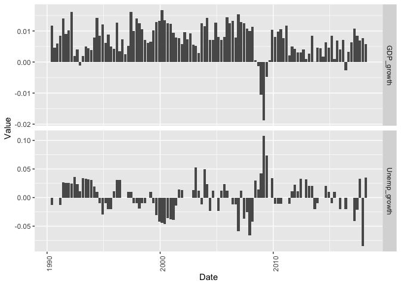
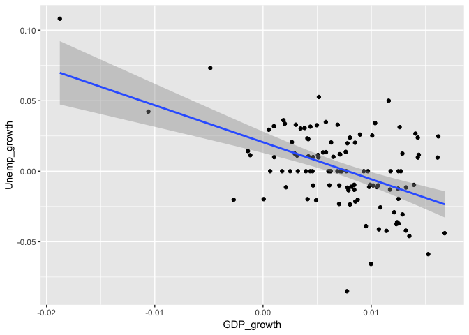

Time-series analysis
================

-   [First analysis](#first-analysis)
-   [Classical processes](#classical-processes)
    -   [The random walk](#the-random-walk)
    -   [Autoregressive processes](#autoregressive-processes)
    -   [Autocorrelogram](#autocorrelogram)
    -   [Estimation](#estimation)
    -   [Forecast](#forecast)
-   [Multivariate analysis](#multivariate-analysis)
    -   [Estimation](#estimation-1)
    -   [Forecast](#forecast-1)
-   [Exercises](#exercises)
    -   [Pursuing the economic study =&gt; CPI](#pursuing-the-economic-study-cpi)
    -   [Unemployment: can ARCH models improve the prediction?](#unemployment-can-arch-models-improve-the-prediction)

This is the companion notebook to the course on Time-series analysis. The dataset consists of 3 series of indicators characterising the French economy.

``` r
library(tidyverse)
# Then change your working directory
if(!require(lubridate)){install.packages("lubridate")}
library(lubridate)
load("economics.RData")
summary(economics)  # Descriptive statistics
```

    ##     Quarter            GDP          Unemployment        CPI        
    ##  Min.   :199001   Min.   :261484   Min.   : 6.80   Min.   : 66.56  
    ##  1st Qu.:199701   1st Qu.:318372   1st Qu.: 8.10   1st Qu.: 77.47  
    ##  Median :200401   Median :421974   Median : 8.90   Median : 85.59  
    ##  Mean   :200365   Mean   :419099   Mean   : 8.91   Mean   : 85.92  
    ##  3rd Qu.:201101   3rd Qu.:511961   3rd Qu.: 9.80   3rd Qu.: 95.67  
    ##  Max.   :201801   Max.   :582503   Max.   :10.40   Max.   :101.72

``` r
economics <- mutate(economics, Year = as.numeric(substr(Quarter,1,4)), Quarter = as.numeric(substr(Quarter,5,6)))
economics <- mutate(economics, Date = make_date(year = Year, month = 3*Quarter, day = 1))
```

First analysis
--------------

The first thing to do is often to have a look at the data:

``` r
eco <- economics %>% select(-Year, -Quarter) %>% gather(key = Variable, value = Value, -Date) 
ggplot(eco, aes(x = Date, y = Value)) + geom_line() + facet_grid(Variable ~ .,  scales = 'free')
```



Obviously, these series are not stationary (at least the first two), if only because of their trend which implies that their mean increases with time (the range of the distribution is clearly not constant). One possible solution is to study variations:
*Δ**X*<sub>*t*</sub> = *X*<sub>*t*</sub> − *X*<sub>*t* − 1</sub>

``` r
economics <- economics %>% mutate(GDP_var = GDP - lag(GDP))    # Raw variation in GDP
ggplot(economics, aes(x = Date, y = GDP_var)) + geom_point()
```


Clearly, this is better. Indeed, it seems that the variations in the French GDP display a somewhat coherent pattern. Nevertheless, the classical transform used to \`stationarise' series consists in computing growth, i.e., relative variations:
$$r\_t=\\frac{X\_t}{X\_{t-1}}-1$$
 I use the notation r because in finance, these series are called 'returns'. Henceforth, I will often use this abuse of language.

``` r
economics <- economics %>% mutate(GDP_growth = GDP / lag(GDP) - 1) # Growth in GDP
ggplot(economics, aes(x = Date, y = GDP_growth)) + geom_bar(stat = "identity") 
```



The original process can be reconstructed from growth/returns:
$$X\_t=X\_0\\prod\_{s=1}^t(1+r\_s).$$

Below, we show an example that starts from random returns and the recomposes the integrated process.

``` r
r <- runif(12, min = -0.5, max = 0.5)   # We generate completely random returns
x <- cumprod(1+r)                       # We use the cumulative product over 1+r
time <- rep(1:12)                       # We generate time
data <- data.frame(time, r, x)          # We aggregate the data
data <- data %>% gather(key = type, value = value, -time) # And put it into ggplot format
data %>% ggplot(aes(x = time, y = value)) + geom_line() +facet_grid(type~., scales = "free")
```



When returns (top plot) are negative (resp. positive), the process x (bottom plot) decreases (resp. increases).

Classical processes
-------------------

### The random walk

The most typical random process. Increasing or decreasing by one with probability 1/2 (sum of Bernoulli realisations).

``` r
x <- 0              # A first example, step-by-step. The process starts at zero.
nb_steps <- 15      # We simulate 15 points
for(n in 2:nb_steps){
  x[n] <- x[n-1] + 2 * rbinom(1, 1, 0.5) - 1 # The Bernoulli variables are not straightforwadly generated
}
data.frame(date = 1:nb_steps, x) %>% ggplot(aes(x = date, y = x)) + geom_line()
```



Instead of a loop, we can directly use the cumulative sum.

``` r
x <- 0              # A quicker, neater way to proceed.
nb_steps <- 80      # A larger number of points
x <- (2*rbinom(nb_steps, 1, 0.5) - 1) %>% cumsum()  # Here, we directly use the cumulative sum
df <- data.frame(time = 1:nb_steps, x)              # Wrapping the data
ggplot(df, aes(x = time, y = x)) + geom_line()
```



### Autoregressive processes

Autoregressive processes add memory to the trajectory: increments are no longer independent. Below, we build a trajectory of one such process, the AR(1), defined by
*X*<sub>*t*</sub> = *a* + *b**X*<sub>*t* − 1</sub> + *ϵ*<sub>*t*</sub>

``` r
a <- 1   # Parameter
b <- 0.5 # Parameter: must be smaller than 1 in absolute value. If not: explosion
x <- 1   # Initial value.
nb_steps <- 20
for(n in 2:nb_steps){
  x[n] <- a + b * x[n-1] + rnorm(1) # Updating the process according to formula
}
data.frame(date = 1:nb_steps, x) %>% ggplot(aes(x = date, y = x)) + geom_line()
```

-1.png)

Let's use a dedicated function. Remember, R has many useful functions/packages. The AR process is a special case of a more general family: the ARIMA processes. Simulation is done via arima.sim. The documentation is available at <https://stat.ethz.ch/R-manual/R-devel/library/stats/html/arima.sim.html>

``` r
Nb_points <- 100
AR <- arima.sim(list(ar = c(0.9)), Nb_points)   # Here is the simulation part
AR <- data.frame(Time = 1:Nb_points, AR)        # Wrapping the data                       
AR %>% ggplot(aes(x = Time, y = AR)) + geom_line() # Plotting
```

%20v2-1.png)

### Autocorrelogram

The autocorrelogram computes the correlation between lagged values of the series. Assuming the series is stationary with constant mean *m* and variance *v*, it is defined as:
*ρ*<sub>*j*</sub> = *v*<sup>−1</sup>𝔼\[(*X*<sub>*t*</sub> − *m*)(*X*<sub>*t* − *j*</sub> − *m*)\]
 It is computed in R with the acf() function and automatically provides the values for *j* ∈ (0, 20).

``` r
ac <- acf(economics$GDP_growth, na.action = na.pass, plot = FALSE)
plot(ac, main = "") # Removes the title
```


``` r
ac2 <- acf(AR$AR, plot = FALSE)
plot(ac2, main = "")
```



We see autocorrelation in the French economic growth. This probably comes from so-called economic cycles (periods of growth followed by recessions). For an AR(1) process, the autocorrelation decreases at the rate *b*<sup>*j*</sup>. In the above example, b=0.9, so the decrease is slow.

### Estimation

For a given series, one may want to estimate the corresponding AR parameters (if that seems relevant). In R, several estimators exist (OLS, MLE). We look a several below.

``` r
ar(economics$GDP_growth, na.action = na.pass, order.max = 1)   # Autoregressive coefficient
```

    ## 
    ## Call:
    ## ar(x = economics$GDP_growth, order.max = 1, na.action = na.pass)
    ## 
    ## Coefficients:
    ##      1  
    ## 0.5829  
    ## 
    ## Order selected 1  sigma^2 estimated as  1.896e-05

``` r
series <- economics$GDP_growth[2: nrow(economics)]             # Taking out the NA term
ar(series, order.max = 1, method = "ols")                   # Classical least-squares method
```

    ## 
    ## Call:
    ## ar(x = series, order.max = 1, method = "ols")
    ## 
    ## Coefficients:
    ##      1  
    ## 0.5833  
    ## 
    ## Intercept: -4.826e-05 (0.0004093) 
    ## 
    ## Order selected 1  sigma^2 estimated as  1.86e-05

``` r
ar(series, order.max = 1, method = "mle")                   # Max likelihood
```

    ## 
    ## Call:
    ## ar(x = series, order.max = 1, method = "mle")
    ## 
    ## Coefficients:
    ##      1  
    ## 0.5819  
    ## 
    ## Order selected 1  sigma^2 estimated as  1.856e-05

``` r
rho <- cor(economics$GDP_growth, lag(economics$GDP_growth), use = "complete")
rho                                                         # Moment-based value
```

    ## [1] 0.5850411

Once the model is estimated, we can forecast the future value.

### Forecast

In R, a predict() function is often provided in time-series packages. But be careful, the output changes from one to another.

``` r
ar_est <- ar(series, order.max = 1, method = "mle") 
predict(ar_est)
```

    ## $pred
    ## Time Series:
    ## Start = 113 
    ## End = 113 
    ## Frequency = 1 
    ## [1] 0.006385801
    ## 
    ## $se
    ## Time Series:
    ## Start = 113 
    ## End = 113 
    ## Frequency = 1 
    ## [1] 0.004307705

``` r
0.583*series[112] + mean(series)*(1-0.583) # Manual check!
```

    ## [1] 0.006384121

We compare it to the conditional mean: pretty close. The conditional mean is simply $\\mathbb{E}\[X\_{t+1}|X\_t\]=\\hat{a}+\\hat{b}X\_t$.

Multivariate analysis
---------------------

In this section, we come back to macro-economic data. \#\#\# First steps Often, variables inside a sample are expected to be related. Hence, understanding the relationships between them is crucial, especially for prediction purposes.

``` r
economics <- economics %>% mutate(Unemp_growth = Unemployment / lag(Unemployment) - 1) # Growth of unemployment
cor(economics$GDP, economics$Unemployment)                    # Correlation GDP/Unemp
```

    ## [1] 0.02307862

``` r
cor(economics$GDP_growth, economics$Unemp_growth, use = "complete") # Correlation GDP growth / Unemp growth
```

    ## [1] -0.5047352

``` r
cor(lag(economics$GDP_growth), economics$Unemp_growth, use = "complete") # Correlation past GDP growth / Unemp growth
```

    ## [1] -0.4970082

Raw GDP and unemployment appear unrelated. But relative variations in both variables are negatively correlated: when GDP increases, unemployment decreases. The last correlation show that even the previous value of change in growth is correlated to current change in unemployment.

Below, we visually confirm these results. First, variations indeed co-move in opposite directions. Second, the linear approximation between the two variables does have a negative slope, thereby indicating negative correlation.

``` r
data <- economics %>% select(Date, GDP_growth, Unemp_growth) %>% gather(key = Indicator, value = Value, -Date) 
data %>% ggplot(aes(x = Date, y = Value)) + 
  geom_bar(stat = "identity") + facet_grid(Indicator~., scales = "free") +
  theme(axis.text.x = element_text(angle = 90))
```



``` r
economics %>% ggplot(aes(x = GDP_growth, y = Unemp_growth)) + geom_point() + geom_smooth(method = "lm")
```



### Estimation

A simple approach for multivariate time-series is the vector auto-regressive model. It reads
**X**<sub>*t*</sub> = **A****X**<sub>*t* − 1</sub> + **ϵ**<sub>*t*</sub>,
 where **X**<sub>*t*</sub> and **ϵ**<sub>*t*</sub> are *n*-dimensional vectors and **A** is an *n* × *n* matrix.

Below, we estimate a vector autoregression model on GDP and unemployment growths.

``` r
if(!require(vars)){install.packages("vars")}
library(vars)     # This is the package for VAR models
library(tidyverse)
# FIRST, we prepare the data
var_data <- economics %>% dplyr::select(GDP_growth, Unemp_growth) # Beware: MASS package overrides select() function
train_data <- var_data[2:112,] # Fitting the model on all dates but the last
test_data <- var_data[113,]    # Testing the model on the last date
VAR_est <- VAR(train_data, p = 2)   # Fitting
VAR_est                             # Showing the result
```

    ## 
    ## VAR Estimation Results:
    ## ======================= 
    ## 
    ## Estimated coefficients for equation GDP_growth: 
    ## =============================================== 
    ## Call:
    ## GDP_growth = GDP_growth.l1 + Unemp_growth.l1 + GDP_growth.l2 + Unemp_growth.l2 + const 
    ## 
    ##   GDP_growth.l1 Unemp_growth.l1   GDP_growth.l2 Unemp_growth.l2 
    ##     0.479483246    -0.015960002     0.191987786     0.023239009 
    ##           const 
    ##     0.002365023 
    ## 
    ## 
    ## Estimated coefficients for equation Unemp_growth: 
    ## ================================================= 
    ## Call:
    ## Unemp_growth = GDP_growth.l1 + Unemp_growth.l1 + GDP_growth.l2 + Unemp_growth.l2 + const 
    ## 
    ##   GDP_growth.l1 Unemp_growth.l1   GDP_growth.l2 Unemp_growth.l2 
    ##     -1.62836886      0.26023443     -0.35321054      0.04992616 
    ##           const 
    ##      0.01502423

The interpretation is interesting. The first coefficients pertain to the GDP equation. We see that the strong coefficients (especially the first one) are associated to GDP. This means that past GDP is the most important to forecast future GDP (the so-called economic cycles).
The second batch of coefficients are linked to unemployment. Here, again, the strongest values come from past realisations of GDP. Hence, in the determination of future unemployment rates, growth in GDP is more important than past growth in unemployment. Which makes sense.

### Forecast

Finally, the forecast.

``` r
predict(VAR_est, n.ahead = 1)  # The predict() function
```

    ## $GDP_growth
    ##                        fcst       lower      upper          CI
    ## GDP_growth.fcst 0.009536154 0.001051062 0.01802125 0.008485093
    ## 
    ## $Unemp_growth
    ##                          fcst       lower      upper         CI
    ## Unemp_growth.fcst -0.02055491 -0.06647668 0.02536686 0.04592177

``` r
test_data
```

    ##      GDP_growth Unemp_growth
    ## 113 0.005806886   0.03488372

The quality of the forecast in this particular exemple is not impressive...

Exercises
---------

### Pursuing the economic study =&gt; CPI

1.  Add the relative variation (growth) of the CPI in the data.
2.  Plot its time-series
3.  Fit (estimate) an AR(1) models both for the CPI and, afterwards, for its relative variations. Is the raw CPI stationary? How can we interpret the outome of the second estimation?

### Unemployment: can ARCH models improve the prediction?

1.  Install and load the tseries package.
2.  Have a look at the documentation of the package: <https://cran.r-project.org/web/packages/tseries/tseries.pdf> More precisely, we will use the garch() and predict() functions.
3.  Fit an ARCH model on all values of the relative Unemp variations, except the last one. Predict the last value. For a simple arch, the second argument is order = c(0,1).
