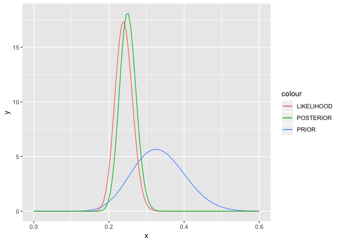
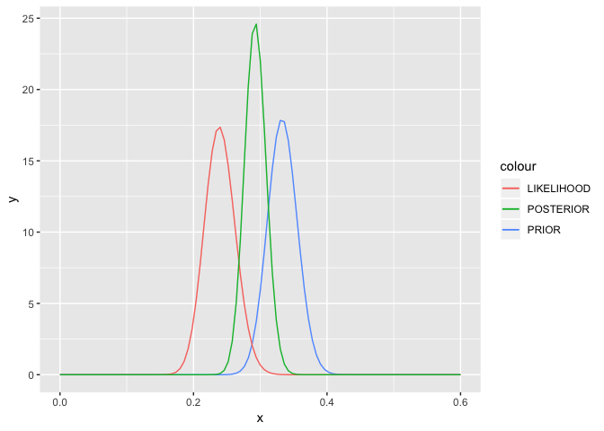
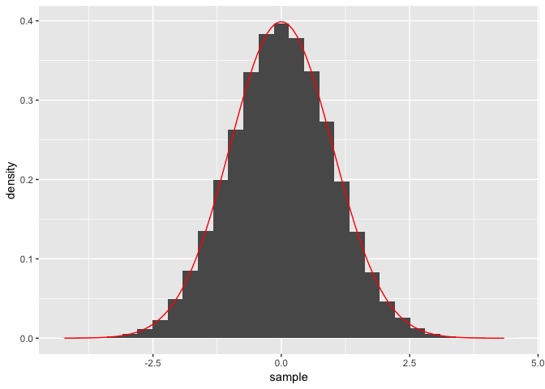
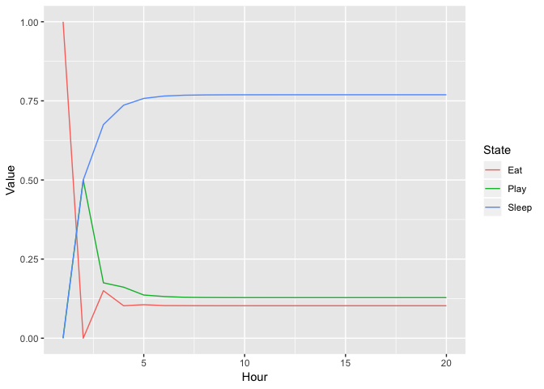
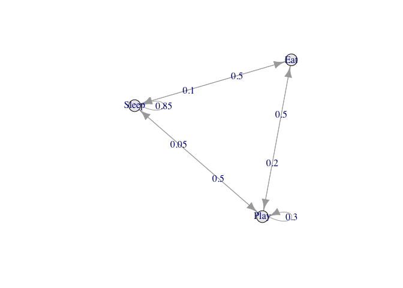

Bayesian inference
================

-   [First analysis: Beta conjugates](#first-analysis-beta-conjugates)
-   [Second analysis: non-conjugage priors on grids](#second-analysis-non-conjugage-priors-on-grids)
-   [Markov Chains](#markov-chains)
-   [Exercises](#exercises)
    -   [Grid approximation](#grid-approximation)
    -   [Monty Hall by Monte-Carlo](#monty-hall-by-monte-carlo)
    -   [Conjugate prior: gender bias](#conjugate-prior-gender-bias)

This is the companion notebook to the course on Bayesian inference. We start by loading the packages and the data.

``` r
library(tidyverse)
# Then change your working directory
if (!require("expm")) install.packages("expm") # Only installs if missing
if (!require("markovchain")) install.packages("markovchain") # Only installs if missing
load("anes.RData")
```

First analysis: Beta conjugates
-------------------------------

The simplest case when inferring proportions. Combining binomial likelihood with beta prior is appealing, given the form of the densities. The posterior distribution follows a
*B*(*a* + *y*, *b* + *n* − *y*)
 distribution, where n is the sample size, y is the number of 'correct' occurrences and a and b are the prior Beta parameters.

``` r
anes_1996 <- anes %>% filter(Date == 1996)          # We keep a year with low number of respondents
y <- sum(anes_1996$Party_simple == "Republican")    # Number of Republicans
n <- nrow(anes_1996)                                # Number of observations
a <- 15                                             # Initial Beta parameter
b <- 30                                             # Initial Beta parameter
ggplot(data.frame(x = c(0,0.6)), aes(x = x)) + 
  stat_function(fun = dbeta, args = list(shape1 = a, shape2 = b), aes(color = "PRIOR")) +
  stat_function(fun = dbeta, args = list(shape1 = y , shape2 = n - y ), aes(color = "LIKELIHOOD")) +
  stat_function(fun = dbeta, args = list(shape1 = y + a, shape2 = n - y + b), aes(color = "POSTERIOR"))
```



``` r
# CASE when the prior is strongly concentrated around 1/3
a <- 150 # Initial Beta parameter
b <- 300 # Initial Beta parameter
ggplot(data.frame(x = c(0,0.6)), aes(x = x)) + 
  stat_function(fun = dbeta, args = list(shape1 = a, shape2 = b), aes(color = "PRIOR")) +
  stat_function(fun = dbeta, args = list(shape1 = y , shape2 = n - y ), aes(color = "LIKELIHOOD")) +
  stat_function(fun = dbeta, args = list(shape1 = y + a, shape2 = n - y + b), aes(color = "POSTERIOR"))
```



In the first case, the prior is diluted because the sample is already large (346 observations). One way around that is to increase the magnitude of prior parameters. This increases their relative importance in the final output.

Second analysis: non-conjugage priors on grids
----------------------------------------------

A more flexible approach is to approximate the posterior distribution by means of discretisation. Below, we show what this approximation can look like if the grid is coarse.

``` r
# Illustration first: approximative rectangles via sampling
sample <- rnorm(10^5) 
sample %>% data.frame() %>% ggplot(aes(x = sample)) + geom_histogram(aes(y = ..density..)) + 
  stat_function(fun = dnorm, args = list(mean = 0, sd = 1), color = "red")
```

    ## `stat_bin()` using `bins = 30`. Pick better value with `binwidth`.



Next, we apply this technique to determine the proportion of Republicans in 1996. We choose a fine grid, with 1000 points. We use a Gaussian prior. All the steps are commented in the code.

``` r
# Inspired by Kruschke's Doing Bayesian Data Analysis
theta <- seq(0, 1, length = 1001)                # The grid for the distribution of theta
prior <- dnorm(theta, mean = 0.3, sd = 0.03)     # Specifying the prior: use your imagination to test different shapes!
prior <- prior / sum(prior)                      # The prior sums to one
k <- sum(anes_1996$Party_simple == "Republican") # Number of successes
n <- nrow(anes_1996)                             # Number of trials
likelihood <- theta^k * (1-theta)^(n-k)          # p(Data|Theta)
likelihood <- likelihood / sum(likelihood)       # Normalization => for plotting essentially
posterior <- prior * likelihood                  # p(Theta|Data)
posterior <- posterior / sum(posterior)          # Normalization
df <- data.frame(theta, prior, likelihood, posterior) %>% gather(key = distribution, value = value , -theta)
ggplot(df, aes(x = theta, y = value)) + geom_line(aes(color = distribution)) + xlim(0.1,0.6)
```


Given the large number of points, the curves are quite smooth.

Below, we try this approach on sampled data. We aim to plot the distribution of the mean of a Gaussian distribution with known sd (= 1).

``` r
n_sample <- 20                                  # Data size
n_grid <- 100                                   # Number of grid points
sample <- rnorm(n_sample)                       # Generating the data
m <- seq(-0.7, 0.7, length = n_grid + 1)        # The grid for the distribution of theta (the parameter: here, it's m)
m_prior <- 0.1                                  # Prior parameter (mean)
s_prior <- 0.2                                  # Prior parameter (sd)
prior <- dnorm(m, mean = m_prior, sd = s_prior) # Specifying the prior: use your imagination to test other/different shapes!
prior <- prior / sum(prior)                     # The prior sums to one
likelihood <- sapply(m, function(x) dnorm(sample, mean = x, sd = 1)) %>%
  apply(., 2, prod)                             # p(Data|Theta). NOTE: only works on small samples.
likelihood <- likelihood / sum(likelihood)      # Normalization => for plotting purpose essentially
posterior <- prior * likelihood                 # p(Theta|Data)
posterior <- posterior / sum(posterior)         # Normalization
df <- data.frame(m, prior, likelihood, posterior) %>% gather(key = distribution, value = value , -m)
ggplot(df, aes(x = m, y = value)) + geom_line(aes(color = distribution))
```


``` r
# Comparison with analytical formula
s_star <- sqrt(1/(1/s_prior^2+length(sample)/1))
m_star <- (m_prior/s_prior^2+sum(sample)/1)/(1/s_star^2)
analytical <- data.frame(m, value = dnorm(m, mean = m_star, sd = s_star) )
analytical$value <- analytical$value / sum(analytical$value)
ggplot(df, aes(x = m, y = value * n_sample )) + geom_line(aes(color = distribution)) +
  geom_line(data = analytical, aes(color = "analytical"))
```


The curves completely coincide: the red one is printed over the turquoise one.

Markov Chains
-------------

Below, we introduce the concept of Markov chain. We consider the canonical example: sleep-eat-play. The transition between the states is driven by the following matrix:

|     |   S  |   E  |   P  |
|:---:|:----:|:----:|:----:|
|  S  | 0.85 | 0.10 | 0.05 |
|  E  | 0.50 | 0.00 | 0.50 |
|  P  | 0.50 | 0.20 | 0.30 |

The first column is the current state whereas the first row is the future state. Hence, if the individual is currently playing, there is a 20% chance that he/she will be eating next.

``` r
P <- rbind(c(0.85,0.10,0.05), c(0.5,0,0.5), c(0.5,0.2,0.3)) # Transition matrix
x <- c(0,1,0)                                               # Initial state: eating
x %*% P                                                     # Prob. in t+1
```

    ##      [,1] [,2] [,3]
    ## [1,]  0.5    0  0.5

``` r
x %*% P %*% P                                               # Prob. in t+2
```

    ##       [,1] [,2]  [,3]
    ## [1,] 0.675 0.15 0.175

``` r
x %*% (P %^% 10) %>% round(3)                               # Long term probability (10 steps)
```

    ##       [,1]  [,2]  [,3]
    ## [1,] 0.769 0.103 0.128

Above, we computed the probabilities of each state (starting at the second one): one step ahead, two steps ahead and 10 steps ahead.

Below, we keep track of these probabilities and plot them. We start at state 2, which is eating (try other starting points!).

``` r
N <- 20                                                     # Number of steps
z <- matrix(0, ncol = 3, nrow = N)                          # Create matrix of probability evolution
z[1,] <- x                                                  # Initialise starting point: eat!
for(i in 2:N){                                              # Loop on time
  z[i, ] <- z[i-1, ] %*% P                                  # Updating the probability
}
z <- data.frame(1:N,z)                                      # Gathering the data
colnames(z) <- c("Hour", "Sleep", "Eat", "Play")
z <- z %>% gather(key = State, value = Value, -Hour)        # Putting in ggplot format
ggplot(z, aes(x = Hour, y = Value, color = State)) + geom_line() # Showing the convergence
```



Finally, we compare the terminal value with the fixed-point of the system.

``` r
Q <- cbind(P - diag(3), 1) # Adding the sum(Prob.) = 1 constraint
b <- c(0,0,0,1) 
b %*% t(Q) %*% solve(Q %*% t(Q)) # Ha! Same as the long-term probbabilities
```

    ##           [,1]      [,2]      [,3]
    ## [1,] 0.7692308 0.1025641 0.1282051

Now, there also exists a package for Markov-Chain simulations.

``` r
library(markovchain) # Great package for multi-treatment of Markov Chains
MC <- new("markovchain", states = c("Sleep", "Eat", "Play"),
          transitionMatrix = P, name="MC")
plot(MC, package="diagram", box.size = 0.08)    # Plot the transition system
```



``` r
simul <- rmarkovchain(1000, MC) %>% as.factor() # Simulate!
summary(simul)                                  # Do the proportions match?
```

    ##   Eat  Play Sleep 
    ##    98   107   795

If you want to go further towards Markov-Chain Monte-Carlo, have a look at the mcmc package, or at: <https://nicercode.github.io/guides/mcmc/>

Exercises
---------

### Grid approximation

1.  Sample 150 observations of a Normal (mean = 0.5, sd = 0.1) distribution.
2.  Have a look at the histogram (take 15 bins): could be a beta law, don't you think? Let's say we know the first parameter of the beta law is equal to a = 4. Pick any prior you want and compute the posterior density / histogram of the second parameter of the corresponding beta law.

### Monty Hall by Monte-Carlo

Create a Monte-Carlo simulation that replicates the Monty-Hall problem. Show that the probability of winning when changing the original choice is close to.

### Conjugate prior: gender bias

Given the anes\_1996 dataset, compute (i.e., plot) the posterior distribution of the proportion of women (assume a Beta prior so that the distribution is easily derived).
