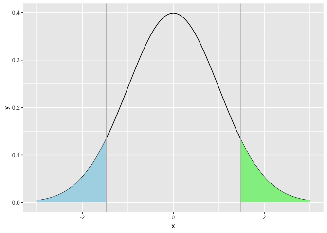
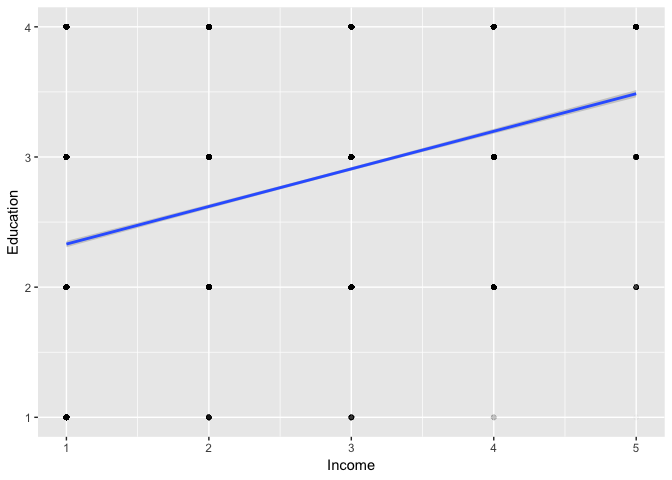
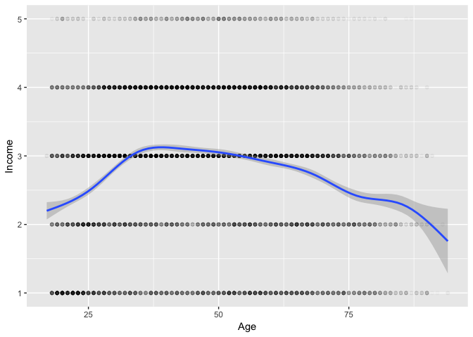

Hypothesis testing
================

-   [Testing the mean](#testing-the-mean)
    -   [One sample](#one-sample)
    -   [Two samples](#two-samples)
-   [Regression analysis](#regression-analysis)
-   [Exercises](#exercises)
    -   [Diamonds prices!](#diamonds-prices)

This is the companion notebook to the course on Hypothesis testing with application to regression coefficients. We start by testing means, using the ANES database.

``` r
library(tidyverse) # Start with the package
load("anes.RData") # Then, change your working directory & load the data
```

Testing the mean
----------------

### One sample

The simplest and most comprehensible test. We look at the proportion of women among respondents of the surveys.

``` r
gender <- anes$Gender %>% as.numeric %>% -1  # Gender is recoded: 0 for male, 1 for female
N <- length(gender)                          # Sample size
mean(gender)                                 # Sample mean
```

    ## [1] 0.5360138

``` r
m <- 0.53                                    # Our benchmark, the sample mean => more women!
s <- sqrt(0.51*(1-0.51))                     # Assuming knowledge of 'true' sd
t <- sqrt(N)*(sum(gender)/N-m)/s             # Applying the formula 

ggplot(data.frame(x = c(-3, 3)), aes(x)) +
  stat_function(fun = dnorm) + 
  stat_function(fun = dnorm, xlim = c(-3,-t), geom = "area", fill = "lightblue") + 
  stat_function(fun = dnorm, xlim = c(t, 3), geom = "area", fill = "lightgreen") + 
  geom_vline(xintercept=-t, color = "grey") + geom_vline(xintercept=t, color = "grey")
```



The shaded zones represent the odds of observing data that would be more extreme (i.e., further from zero), if we assume the null to be true. In this case, under the null, $\\hat{m}=m$. To get the probability (p-value) associated to t (assuming 'known' standard deviation):

``` r
2*pnorm(-abs(t))        # For the two-sided test: sample mean != m
```

    ## [1] 0.1403577

``` r
pnorm(-abs(t))          # For the one-sided test: sample mean < m
```

    ## [1] 0.07017885

``` r
t.test(gender, mu = m)  # Using the built-in t-test (Student)
```

    ## 
    ##  One Sample t-test
    ## 
    ## data:  gender
    ## t = 1.478, df = 15021, p-value = 0.1394
    ## alternative hypothesis: true mean is not equal to 0.53
    ## 95 percent confidence interval:
    ##  0.5280380 0.5439896
    ## sample estimates:
    ## mean of x 
    ## 0.5360138

The p-value implies that the mean is not strongly different from 0.53. Nonetheless, the test for pure parity *m* = 0.5 would show that parity is not reached in this sample.

### Two samples

First, a look at the data: we build a pivot table based on years.

``` r
synth <- anes %>% 
    group_by(Date) %>% 
    summarize(prop = mean(Gender == "Female"), size = n()) # Computes proportions and sample sizes
synth
```

    ## # A tibble: 8 x 3
    ##    Date  prop  size
    ##   <dbl> <dbl> <int>
    ## 1  1990 0.541  1742
    ## 2  1992 0.526   980
    ## 3  1996 0.592   346
    ## 4  1998 0.548  1150
    ## 5  2004 0.533  1034
    ## 6  2008 0.561  2062
    ## 7  2012 0.513  5520
    ## 8  2016 0.558  2188

Proportions and sample sizes vary across time. Is it likely that the proportions of women respondents in 1996 and 2012 are different?

``` r
test_stat <- function(m1,m2,n1,n2){  # Creates a function that performs the simple two-mean test
  (m1-m2)/sqrt(m1*(1-m1)/n1+m2*(1-m2)/n2)
}
t <- test_stat(synth$prop[3], synth$prop[7], synth$size[3], synth$size[7]) # We apply it on the third and seventh proportions
t                   # Show t
```

    ## [1] 2.914288

``` r
2*pnorm(-abs(t))    # p-value
```

    ## [1] 0.003565009

Even at a low significance level, the null hypothesis must be rejected: the two proportions are not equal. Let's compare the last value (2016) with all others.

``` r
m <- synth$prop[8]
n <- synth$size[8]
test_stat(m,synth$prop,n,synth$size)
```

    ## [1]  1.0532517  1.6739717 -1.2257876  0.5388272  1.3140163 -0.2309392
    ## [7]  3.5436459  0.0000000

If we set the threshold to |*t*|&gt;2 (5% significance level), only the 7th survey stands out. This means that the demographic properties of the survey are different, at least at the gender level and comparisons and predictions should account for that.

Finally, we look at tests that do not rely on proporions, but general series. Let's compare the age of women versus the age of men in our sample. We resort to the built-in t.test() function. See below for documentation: <https://stat.ethz.ch/R-manual/R-devel/library/stats/html/t.test.html>

``` r
age_men <- filter(anes, Gender == "Male")$Age       # Ages of all men
age_women <- filter(anes, Gender == "Female")$Age   # Ages of all women
mean(age_men)                                       # Average age of men
```

    ## [1] 47.51808

``` r
mean(age_women)                                     # Average age of women
```

    ## [1] 47.99342

``` r
t.test(age_men, age_women)                          # Test: are they equal?
```

    ## 
    ##  Welch Two Sample t-test
    ## 
    ## data:  age_men and age_women
    ## t = -1.6889, df = 14812, p-value = 0.09126
    ## alternative hypothesis: true difference in means is not equal to 0
    ## 95 percent confidence interval:
    ##  -1.02701378  0.07633316
    ## sample estimates:
    ## mean of x mean of y 
    ##  47.51808  47.99342

The p-value is rather small, but not significantly enough. We cannot reject the null hypothesis: average ages are not statistically different..

Regression analysis
-------------------

We now turn to regression analysis. Our aim is to check if, in our ANES dataset, there is a link between education and income. Since these variables are (ordered) categorical, we must first translate them into number. Luckily, the as.numeric() function does just that. We store these results in a parallel database, called anes2.

``` r
anes2 <- anes %>% select(-Date, -Race, -Religion, -Nb_children)  # New data variable
anes2$Income <- anes2$Income %>% as.numeric()                    # Numerical income category, could use: mutate_if()
anes2$Education <- anes2$Education %>% as.numeric()              # Numerical education category
head(anes2)                                                      # A preview of the data
```

    ##   Age Gender Education Income Party_simple
    ## 1  57   Male         4      4   Republican
    ## 2  83 Female         1      1     Democrat
    ## 3  49 Female         2      4     Democrat
    ## 4  21   Male         1      3  Independent
    ## 5  23 Female         2      1  Independent
    ## 6  26 Female         2      1  Independent

``` r
anes2 %>% ggplot(aes(x = Income, y = Education)) + 
    geom_point(alpha = 0.01) + geom_smooth(method='lm')          # A visual hint 
```



``` r
lm(Income ~ Education, data = anes2) %>% summary()               # The outcome of the regression
```

    ## 
    ## Call:
    ## lm(formula = Income ~ Education, data = anes2)
    ## 
    ## Residuals:
    ##     Min      1Q  Median      3Q     Max 
    ## -2.3974 -0.9006  0.0994  0.6026  3.0930 
    ## 
    ## Coefficients:
    ##             Estimate Std. Error t value Pr(>|t|)    
    ## (Intercept) 1.410192   0.029624   47.60   <2e-16 ***
    ## Education   0.496802   0.009903   50.17   <2e-16 ***
    ## ---
    ## Signif. codes:  0 '***' 0.001 '**' 0.01 '*' 0.05 '.' 0.1 ' ' 1
    ## 
    ## Residual standard error: 1.065 on 15020 degrees of freedom
    ## Multiple R-squared:  0.1435, Adjusted R-squared:  0.1434 
    ## F-statistic:  2517 on 1 and 15020 DF,  p-value: < 2.2e-16

Because of the categorical nature of data, the relationship is not obvious to discern. Using alpha intensity, we see that the bottom right zone is empty, meaning that there are few (if any) rich respondents with the lowest level of education (grade school or less). In the regression output, the coefficient associated to education is positive and statistically signification (negligible *p*-value). Hence, the relationship between the two variables seems robust. Note that this is a 'qualitative' assessment nonetheless: it does not imply causality, which is plausible in both directions. Finally, note that the R-squared lies around 0.15, which means that the overall quality of the regression is not exceptional.

Now, given the richness of the data, we can investigate the joint effect of other variables on income. Why not take into account gender, age and party affiliation? Gender and party affiliation can easily be coded in numerical variables. On the contrary, race and religion cannot be used because they cannot straightforwardly be translated into numbers (they are unordered). One-hot encoding could circumvent this problem, but we leave it as exercise (see the **dummies** package for one-hot encoding.)

``` r
anes2$Gender <- as.numeric(anes2$Gender) - 1         # 0 for mean, 1 for women
anes2$Party_simple <- as.numeric(anes2$Party_simple) # 1 for Dems, 2 for Indeps, 3 for GOP
lm(Income ~ Age + Gender + Education + Party_simple, data = anes2) %>% summary()
```

    ## 
    ## Call:
    ## lm(formula = Income ~ Age + Gender + Education + Party_simple, 
    ##     data = anes2)
    ## 
    ## Residuals:
    ##     Min      1Q  Median      3Q     Max 
    ## -2.6787 -0.6813  0.1219  0.7083  3.0809 
    ## 
    ## Coefficients:
    ##                Estimate Std. Error t value Pr(>|t|)    
    ## (Intercept)   1.2693241  0.0439718  28.867   <2e-16 ***
    ## Age           0.0006914  0.0004989   1.386    0.166    
    ## Gender       -0.2147323  0.0172904 -12.419   <2e-16 ***
    ## Education     0.4774415  0.0098619  48.413   <2e-16 ***
    ## Party_simple  0.1480913  0.0109607  13.511   <2e-16 ***
    ## ---
    ## Signif. codes:  0 '***' 0.001 '**' 0.01 '*' 0.05 '.' 0.1 ' ' 1
    ## 
    ## Residual standard error: 1.052 on 15017 degrees of freedom
    ## Multiple R-squared:  0.1639, Adjusted R-squared:  0.1637 
    ## F-statistic: 736.1 on 4 and 15017 DF,  p-value: < 2.2e-16

Age is positively linked to income, but not in a forceful fashion. Gender has a negative impact: given our coding, this means that men earn more than women, on average. The corresponding *p*-value is very small, which highlights that the effect is significant. Education still plays an important role. The *t*-stat associated to it (almost 48) is still incredibly high, underlying its strong impact on income (its importance was not affected by the introduction of the other variables). Finally, party affiliation is also correlated to income. The more the respondent is to the political right, the higher its average income.

Below, we rapidly check these claims with short pivot tables.

``` r
anes %>% group_by(Gender) %>% 
    summarise(avg_income = mean(as.numeric(Income)))            # Male/Female average income
```

    ## # A tibble: 2 x 2
    ##   Gender avg_income
    ##   <ord>       <dbl>
    ## 1 Male         2.98
    ## 2 Female       2.70

``` r
anes %>% group_by(Education) %>% 
    summarise(avg_income = mean(as.numeric(Income)))            # Income by education level
```

    ## # A tibble: 4 x 2
    ##   Education                  avg_income
    ##   <ord>                           <dbl>
    ## 1 Grade school or less             1.78
    ## 2 High school                      2.46
    ## 3 Some college                     2.81
    ## 4 College or advanced degree       3.44

``` r
anes %>% group_by(Party_simple) %>% 
    summarise(avg_income = mean(as.numeric(Income)))            # Income by party affiliation
```

    ## # A tibble: 3 x 2
    ##   Party_simple avg_income
    ##   <ord>             <dbl>
    ## 1 Democrat           2.67
    ## 2 Independent        2.79
    ## 3 Republican         3.12

Clearly, the most marked impact is obtained for education.

As a last investgation, we look at what happens with age.

``` r
anes2 %>% ggplot(aes(x = Age, y = Income)) + geom_point(alpha = 0.02) + stat_smooth()
```



The effect is not monotonous! Income is the highest for a period between 35 and 50 years and then decreases. Under these circumstances, a linear model is not a good fit.

Exercises
---------

### Diamonds prices!

Recall: diamonds are characterized by their clarity: from Included (I1), Slightly Included (SI2), ... to Internally Flawless (IF)
0) Load the tidyverse.
1) Check the occurrence of the clarity variable (diamonds$clarity). Hint: summary() 2) Using the function t.test, test if the price of I1 diamonds is different from that of IF diamonds. Interpret. Below, we aim to explain this result.
3) With the lm() (linear model) function, estimate the linear relatioship between prices and carats of diamonds. Interpret.
4) Since carats are a big driver of prices, maybe this can explain the difference in prices! To check this, test the difference in carats between I1 diamonds and IF diamonds
5) To compare prices, we must first control for diamond size! Among the diamonds between 0.5 and 1 carats, test if the price of I1 diamonds is different from that of IF diamonds.
